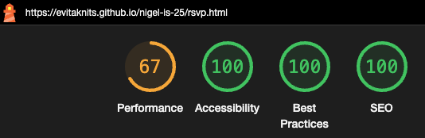

# Nigel is 25: a birthday party invitation site

'Nigel is 25' is a site for a private client to send to his friends and family to invite them to his birthday celebration. It includes information about the activities and locations, as well as providing a quick and easy method of responding to the invite via the website. It will be useful for Nigel's friends and family to have a one-stop digital place they can go to learn about and remind themselves about his birthday celebration. It will also be useful for Nigel as a client to collect RSVP information including dietary requirements to inform his caterer in advance. 

AM I RESPONSIVE SCREENSHOT HERE WITH EACH SCREEN ON A DIFFERENT PART

## REQUIREMENT GATHERING AND PLANNING

Before starting this project, I took some time to think about what the client needed and what the users (the people the client is inviting) needed from the website. I wrote a few user stories and extracted the user needs from them. These needs will also be a part of my manual testing plan. 

### User Stories:

As a birthday party host 
I want a birthday party website with all the information relating to my party
So that my potential guests can be easily kept informed from one central location

As a birthday party host
I want a stylish birthday party website 
So that my potential guests enjoy visiting it and get a good impression of my event

As a birthday party host
I want a responsive birthday party website
So that my potential guests have a good experience of my website from whichever device they choose to access it from

As a birthday party invitee
I want to be able to access all the information about the party in an easy, intuitive and complete way
So that I am fully informed and can communicate the information required from me

### User Needs:

- Information about the activity
- Information about the location
- Information about the date and time
- The ability to RSVP quickly and easily
- The ability to inform the host about dietary requirements quickly and easily
- Viewable on any device so it does not matter which device the website is accessed on
- Clear display and intuitive navigation for ease of use

### Initial Wireframe

With my list of requirements, I then created a very rough wireframe of the homepage on Balsamiq to inform the basic structure of my website: 

This evolved as I worked through the project. I chose to combine certain pages due to there not being enough content for the number of pages I initially planned. I also removed some features that I didn't think were needed to achieve the project, that I have put into the 'Features Left to Implement' section of this document. 

### Colour Palette

Having completed my rough wireframe, I took some time to pick a colour scheme. I was aiming for a vivid, stylish and energising palette. Here is what I chose:

## FEATURES

For each item here you need the feature title, a screenshot of the feature and a short paragraph of the value it gives the user. 

### Existing Features

#### Logo

#### Navigation Bar

#### Footer 

#### RSVP Form

Includes a thank you page 

#### Maps

#### 404 Page

### Features Left To Implement

#### Party Playlist Compiler
This could either be some sort of simple form for people to submit their song requests in a text input, or it could be more sophisticated and allow people to add songs directly to a Spotify playlist. This would depend on the needs of the user and the time available. 

#### Gift Wishlist
Again, this could be kept simple with just an unordered list on the page, or an iframe to an external wishlist site, or it could be more complex with checkboxes and names to claim certain items so there is no duplication of gifts. This would depend on the user needs when fully scoped out. 

## TESTING

I completed the following types of testing throughout development and at the end of my project:

### Manual Feature Testing

As well as running through the list of user needs and ensuring all the features collectively meet all of the needs, I completed the following manual feature testing: 

| Feature           | Test Case | Outcome | Bugs? |
| ----------------  | -------   | ----    | ----- |
| Logo  |  Click on the logo     | The user is taken to the homepage  | Bug 1 |
| Navigation Bar  |  Click on each of the three navigation items from each of the five pages   | The user is taken to the correct page each time   | None |
| RSVP Form |  Submit an empty form   | The mandatory fields (first three inputs) indicate they need filling in | None |
|   | Submit a filled in form | The user is taken to the form submission 'thank you' page | None |
| Footer| Click on each of the social media icons  | The user is taken to the correct social media platform each time. | Bug 6 |
| Maps  | Click on the zoom in and out buttons | The map shows a zoomed in or zoomed out scale according to the which button is pressed      | None |
| | Click on the directions button | The user is taken to Google Maps with the destination pre-filled in the destination field | None |
| | Click on the 'View Larger Map' link | The user is taken to a full screen Google Maps of the same location | None |
| 404 Page | Add some random letters to the end of the url in the browser| The user is taken to the custom 404 page      | Bug 10 |

### Browser Compatibility and Screen Size Responsiveness

I viewed each page on all of the three key screen sizes (mobile, tablet and computer), using the devtools, on four of the most popular browsers. I also used the responsive setting to slide the width of the screen from narrow all the way through to wide to check the transition points. 

Pixel references for each of the screen sizes 

|Screen | Pixels |
|-----|-----|
| Mobile - iPhone SE | 375px |
| Tablet - iPad Mini | 768px |
| Computer | 1366px |

| Browser | Screen Size | Appearance | Responsiveness |
|-------|-----|-----|-----|
| Chrome | Mobile | Good | Good |
| | Tablet | Good | Good |
| | Computer | Good | Good |
| | Transition Points | Good | Bugs 2 + 3 below |
| Firefox | Mobile | Good | Good |
| | Tablet | Good | Good |
| | Computer | Good | Good |
| | Transition Points | Good | Bugs 2 + 3 below |
| Safari | Mobile | Good | Good |
| | Tablet | Good | Good |
| | Computer | Good | Good |
| | Transition Points | Good | Bugs 2 + 3 below |
| Edge | Mobile | Good | Good |
| | Tablet | Good | Good |
| | Computer | Good | Good |
| | Transition Points | Good | Bugs 2 + 3 below |

#### Key Responsiveness Differences

ADD SCREENSHOTS AND EXPLANATIONS HERE

### Code Validation

This was carried out by both link and direct input on the following tools: 
- HTML via [W3C](https://validator.w3.org/)
- CSS via [Jigsaw](https://jigsaw.w3.org/css-validator/)

Screenshot the outcomes below

| Page Tested | Outcome |
|----|----|
|index.html | 
|details.html |
|rsvp.html |
|form-submit.html |
|404.html |
|style.css| 

### Lighthouse and Accessibility testing

I used Lighthouse in Chrome Devtools on each page of my site, using the computer screen size.

| Page | Outcome | Bugs 
|----|----|----|
|index.html |  | Bugs 4, 5, 6 + 7 |
|details.html |  | Bugs 4, 5, 6 + 7 |
|rsvp.html |  | Bugs 4 + 6 |
|form-submit.html |  | Bugs 4 + 6 |
|404.html |  | Bugs 4 + 6 |

I noticed that there was one more accessibility concern that I had overlooked, although lighthouse did not flag it to me: button html tags in my navigation bar. This item is reflected in bug 8 below.

After resolving my lighthouse bugs, I reran the report on each page and here are my new results: 

| Page | Outcome  
|----|----|
|index.html |  | 
|details.html |  |
|rsvp.html |  |
|form-submit.html |  |
|404.html |  |

#### Colour Contrast
I also checked the colour contrast using of my color palette combinations using Coolors: https://coolors.co/contrast-checker/112a46-acc8e5.

**Purple on blue**

**Purple on pink**

This was fixed as part of bug 4 below. 

I didn't check any of the colours on each of the two cream colours (#f7f5f3 and #E6DFD8) I used for backgrounds, as the colour contrast being sufficient was easily discernible by eye.  

Whilst considering colour contrast, I realised that the shade of blue (#71B2B5) I had chosen for the 'RSVP' text on the bar image was most likely not contrasting enough with the darkness of the image. I therefore changed the colour of that text to the same pale cream (#F7F5F3) I had used for the background of the form on the same page to keep the cohesive colour scheme feeling, whilst providing the appropriate colour contrast. I also added a grey shadow border to differentiate the text from the paler elements of the bar image. 

#### Alternative Text 

I went through the site systematically, checking that each image had alternative text.

### Resolved Bugs

#### Bug One

**Issue:** The title above the YouTube video is not aligned with the left edge of the video, whereas the title above the image next to the YouTube video is (see image below). This is only on screens larger than a tablet. 

**BEFORE**

**Fix:** This was because the YouTube video doesn't have the 50px padding either side that the rest of the divs including the photo does, so it made the text look mis-aligned. I fixed this by removing the 50px padding-left of the title so that it lined up with the left edge of the YouTube video.

**AFTER**

**Note:** This was ultimately changed to centered text above both of these but was a bug at the time because I had intended them to be left-aligned.

#### Bug Two

**Issue:** The super-wide screen made the All Bar One image on the homepage look small compared to the YouTube video. 

**BEFORE**

**Fix:** I found that this was because the size of the original image was too small, so I replaced it with a bigger image and this solved the problem.

**AFTER**

#### Bug Three

**Issue:** I found that when scaling the screen using the responsive setting in Chrome Devtools, a certain size between tablet and computer screens made the table on my 'The Details' page go off the edge of the page. This made my navigation bar and header become drastically shorter on the page to accomodate it. 

**BEFORE**

**Fix:** I found that removing the 'width: 100vh' property from the `<section id="when-where">` that this table was in, for my largest screen media query, solved this. 

**AFTER**

#### Bug Four

**Issue:** I originally had #372C57 colour text on a background of #E3705F got my navigation bar but this was flagged as inaccessible: 'Background and foreground colors do not have a sufficient contrast ratio.' 

**BEFORE**

**Fix:** I changed the #372C57 colour text to black text.

**AFTER**

#### Bug Five

**Issue:** My iframes did not have titles. 

**Fix:** I added titles to all iframes. 

This was fixed in [this commit.](https://github.com/EvitaKnits/nigel-is-25/commit/e16570a4181e122138eb04b95bb7491f14cb7ce6)

#### Bug Six

**Issue:** My social media icon links did not have names and the links did not open. 

**Fix:** I added names and fixed the URLs. 

The names were fixed in [this commit](https://github.com/EvitaKnits/nigel-is-25/commit/9253485f39e583856da004fc2fde5f399a03de75) by adding aria-labels to links.

The links opening were fixed in [this commit](https://github.com/EvitaKnits/nigel-is-25/commit/b39c9229268ab10bd444363733640b8612734113) by adding the appropriate target attribute.

#### Bug Seven 

**Issue:** On the homepage I had used `<h3>` headings without using `<h2>` headings first, which was not in-keeping with the sequentially-descending headings rule. On the details page I had used a `<h3>` element to emphasise something on a page rather than styling a `
` element.  

**Fix:** I changed all the `<h3>` text to `
` elements because they were not actually headings and styled them using the `<strong>` tag as well as changing the `font-size` to 'larger' to make them look the same as I had intended when using the `<h3>` tag originally. This unfortunately resulted in my layout becoming misaligned, so I also tweaked the layout until it was good again. 
This change was made in [this commit.](https://github.com/EvitaKnits/nigel-is-25/commit/27a214c1199ae1f2e588dfd524578635a6c11c1a)

### Bug Eight

**Issue:** The footer did not remain at the bottom of the page on the 404.html page. 

**BEFORE**

**Fix:** This was due to me having incorrectly put the `flex-grow` CSS attribute in the parent element and not the child. I moved it and this rectified the issue. 

**AFTER**

### Bug Nine

**Issue:** At some point in my bug fixing I changed something that meant the details paragraph and table at the top of the Details page were no longer centered. 

**BEFORE**

**Fix:** I added `justify-content: center;` to my CSS file for the container that had these two elements in.

**AFTER**

### Unresolved Bugs

I don't believe I have left any of my bugs unresolved.

## DEPLOYMENT

The site was deployed to GitHub pages. 

The steps to deploy are as follows:
- In the GitHub repository, navigate to the Settings tab
- Under 'Code and automation' in the left hand menu, click on 'Pages'
- Make sure the 'Source' and 'Branch' fields are set to 'Deploy from branch' and 'Main' respectively.
- Click save. 
- If the page does not automatically refresh, manually refresh it and at the top there should be a box that states 'Your site is live at' followed by the URL. 

The live link can be found here: https://evitaknits.github.io/nigel-is-25/

## CREDITS

### Content

**Homepage Text Wording**
To write this, I was assisted by Chat GPT with the prompt: "Pretend you are inviting your friends to your birthday party. You are called Nigel, you are a man turning 25 years old. It should be a paragraph long". I tweaked the text it gave me slightly. 

**Details Page Text Wording**
I used Chat GPT again for this wording. This time I wrote a paragraph of content that included the information I wanted on the page: 

'Here is all the information you'll need to turn up in the right place at the right time! The axe throwing activity is optional so you can just turn up to the bar part if you like, or even join us for the activity but duck out after. It'd be lovely to see you at either or both! Make sure you tell me which its you'll be attending via the RSVP form. Cheers all.'

I then gave Chat GPT the content it wrote from the homepage along with my content and asked it to write my paragraph in the same voice as the homepage content. 

**Colours**
I used this page to finesse my chosen colour scheme: https://color.adobe.com/create/color-wheel
I used this page to get the lighter shades of my base colour #71B2B5, that I used in the different states of my submit button on my RSVP form: https://mdigi.tools/lighten-color/#71b2b5 

### Media

**Favicon**
I got my icon from here: https://www.flaticon.com/free-icon/birthday-cake_1412443
I generated the code to paste in the head of my HTML files here: https://realfavicongenerator.net/

**Nigel Photo on the Homepage**
I got the photo from Pexels: https://www.pexels.com/photo/man-on-gray-shirt-portrait-91227/
It is by Stefan Stefancik.

**All Bar One Photo on the Homepage**
I got the photo from Design My Night, here: https://www.designmynight.com/brighton/bars/the-lanes/all-bar-one-brighton

**Bar Picture on the RSVP Page**
I got the photo from Unsplash: https://unsplash.com/photos/brown-wooden-bottle-rack-with-bottles-X5upu8w0ZTc 
It is by Kawasaki Toshihiro.

**Thank You Picture on the Form Submission Page**
I got the photo from Pexels: https://www.pexels.com/photo/light-sign-typography-lighting-519/ 
It is by Gratisography.

**Footer Icons**
I got the icons to use in my footer contact information from: https://fontawesome.com/ 
I learnt about this source from the Love Running Walkthrough module in the Code Institute coursework.

### Sources of Learning

**Responsive iframe**
I learnt how to make my YouTube video iframe responsive with this source: https://www.w3schools.com/howto/howto_css_responsive_iframes.asp

**Table Styling**
I learnt how to style tables from this page: https://www.w3schools.com/html/html_table_borders.asp

**Text over Image**
I learnt to add a text block over my bar image on the RSVP page with this source: https://www.w3schools.com/howto/howto_css_image_text_blocks.asp

**Form Styling**
I learnt how to style forms in general from this page: https://www.w3schools.com/css/css_form.asp
I learnt how to prevent the text input boxes overflowing the border of the form from this page: https://www.w3schools.com/css/css3_box-sizing.asp 

**Box Shadow**
I learnt how to make a shadow around my submit box from here: https://www.w3schools.com/css/css3_shadows_box.asp

**Text Shadow**
I learnt how to add shadow to my RSVP image text here: https://www.w3schools.com/cssref/css3_pr_text-shadow.php 

### General Credit
I want to thank the open source community for the great resources that remind me of what I learnt in my Code Institute lessons, especially https://www.w3schools.com/ and https://developer.mozilla.org/en-US/

I believe I have specifically credited where I used specific items in the previous message but this is a general credit to the reference resources I looked through to remind me how things worked as I went along.  

Every effort has been made to credit everything used but if I find anything else specific later on that needs crediting, that I missed, I will add it. 

## Commits

My understanding of commit messaging has evolved over my time on this project and I can now see there have been times that I had other unrelated changes in my commits that I had not mentioned in the message. I had been trying to reference the main change I made and not the tweaks to other things or maybe edits of the readme that I had also made. My latest commits should be the best examples of this learning and moving more towards best practice. 